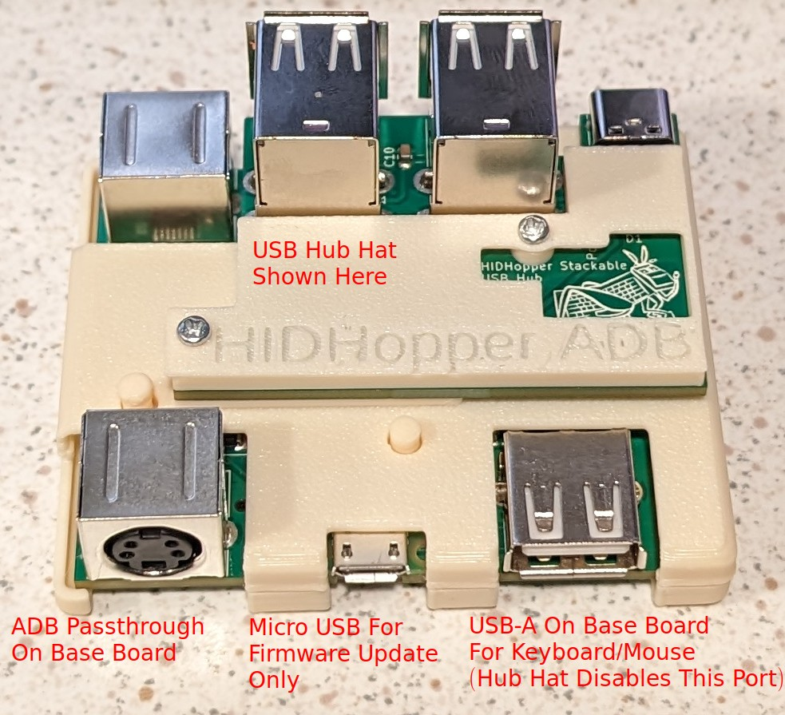

# HIDHopper ADB

HIDHopper ADB is a modified (forked) version of adbuino and QuokkADB.  It is a Raspberry Pi Pico based hardware device which converts USB keyboard and mouse inputs to the Apple Desktop Bus (ADB) standard.

# The Name
HIDHopper comes from the USB "HID" standard, for Human Interface Device.  Hopper just sounded right after HID.

# Picture

# Usage
See the file [doc/HIDHopper.md](https://github.com/TechByAndroda/HIDHopper_ADB/blob/master/doc/HIDHopper.md) for more full documentation

# Quick Usage
- For Base HIDHopper without USB Hub, *before* turning on your computer:
   - Plug in your desired USB peripheral (keyboard or mouse)
   - Plug HIDHopper into the ADB bus
   - Start computer
   - Hot-plug *is not supported*, don't unplug from the ADB Bus *or* unplug the USB device that is connected while the computer is on
- For HIDHopper with the USB Hub Hat, *before* turning on your computer:
   - Ensure the Hub is solidly secured in place with the two mounting screws and top cover plate
   - Plug HIDHopper into the ADB bus
   - Plug in your external 5v USB-C power supply to the connector on the Hub
      - You *must use USB-C External Power* to avoid blowing the ADB Power fuse on your motherboard!
   - Plug in your desired USB keyboard and mouse
   - Hot-plug *is not supported*, don't unplug from the ADB Bus *or* unplug USB devices that are connected while the computer is on
      - Hot-plug of USB devices is finicky, sometimes it works and other times it does not
      - Best to connect before startup, that always works

# Background

This is a fork of Difegue's version of the [adbuino](https://github.com/Difegue/Chaotic-Realm), which was a modified version of [bbraun's](http://synack.net/svn/adbduino/) PS/2 to ADB arduino sketch, with some extra code added to alleviate issues with his own PS/2 keyboard.  For Difegue's original write-up, please read more info [here.](https://tvc-16.science/adbuino-ps2.html).

# How to build and flash HIDHopper ADB

Note: This software is intended to be compiled in an Ubuntu Linux environment.

- Install the Raspberry Pi Pico SDK (https://github.com/raspberrypi/pico-sdk)
- Set the `$PICO_SDK_PATH` environment variable to your pico-sdk directory
- Open a Terminal and "cd" into this project
- From the top level of this project, "cd" to the `src/firmware` folder
- In Terminal, execute the following commands from the above `src/firmware` folder:
  - `mkdir build`
  - `cd build`
  - `cmake ..`
  - `make`
- The build outputs (.uf2, .bin, .elf, etc) will be placed in this folder (path is from the top level of the project):
  - `src/firmware/build/src`
- Next, plug the micro-USB side of a USB cable into HIDHopper
- Press the button on the Pico stick with a pencil or paperclip through the indicated hole on the case
- While holding down the button, plug the USB cable into your computer (then release the button after plugging in)
- You should see an "RPI-RP2" mass storage device appear on your computer
- Drag the ".uf2" file onto that mass storage device
- Once the mass storage device disappears, wait 10 seconds and then you are free to unplug

# References

## Protocol/Software Documentation
- [Apple ADB Manager Documenation](https://developer.apple.com/library/archive/documentation/mac/pdf/Devices/ADB_Manager.pdf)
- [ADB Overview](https://www.lopaciuk.eu/2021/03/26/apple-adb-protocol.html)
- [Microchip Application Note AN591](http://www.t-es-t.hu/download/microchip/an591b.pdf)
- [TMK Documentation](https://github.com/tmk/tmk_keyboard/wiki/Apple-Desktop-Bus)

## Other libraries
- [TinyUSB Library](https://github.com/raspberrypi/tinyusb)
- [MiSTER adb hardware emulation](https://github.com/mist-devel/plus_too/blob/master/adb.v)

## Development resources
- [Running OpenOCD without root](https://forgge.github.io/theCore/guides/running-openocd-without-sudo.html)

## Hardware Links
- [ADB Connector - mouser](https://www.mouser.com/ProductDetail/TE-Connectivity/5749181-1?qs=XlZqES4cpWbRcAMR%2FcJqkQ%3D%3D)
