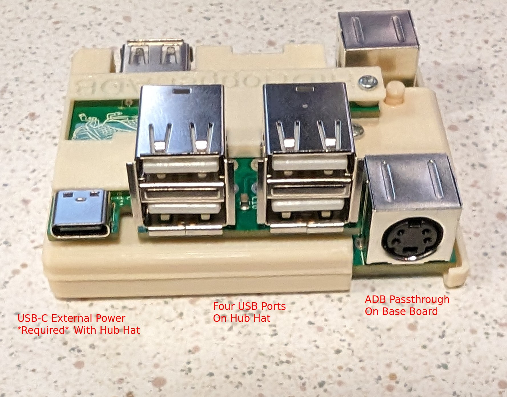

# HIDHopper
A fork of adbuino / QuokkADB, HIDHopper ADB is a USB keyboard and mouse translator which converts USB signaling to Apple's vintage ADB standard.
This is for USB to ADB, and not currently the other way around.

## How to use
1. Attach any USB keyboards/mice to your HIDHopper ADB hardware
   * If you have the USB Hub Hat, EXTERNAL POWER MUST BE PROVIDED via the USB-C port!  Otherwise you run the risk of burning out the ADB Power fuse on your Mac's motherboard!
   * If you have the USB Hub Hat, only the Hat's USB ports work.  The USB port on the base device (by microUSB) will stop working to handle the hub connection.
2. Ensure your HIDHopper device is plugged into your Mac before turning the computer on, and do not un-plug it (or plug it back in) while the system is running
3. The button by the ADB port on HIDHopper is the ADB Soft-Power button and can turn on systems which support that (Color Classic, PowerMac 7300, etc)
   * Systems which do not support ADB Soft-Power must be turned on with their respective physical switch
4. LEDs will turn on and blink with power and ADB activity
5. Again, DO NOT unplug HIDHopper from your Mac while it is turned on.  And DO NOT plug it into your Mac while it's turned on.  Only connect or disconnect while your Mac is turned off.

# Hardware

## Ports

Every HIDHopper ADB device comes with:
* Two ADB ports, allowing daisy-chaining
* One USB-A port for keyboard/mouse (This port is disabled if you are using the Hub Hat)
* One micro-USB port (for firmware upgrades)
* One 4-pin jumper header for the USB Hub Hat

# Other

## Special Key-combos
The special keyboad commands start with `CTRL + SHIFT + CAPS LOCK` and a letter key.  Example: `CTRL + SHIFT + CAPS LOCK + V` ghost types the firmware version.
 - `V` - Ghost types firmware version
 - `L` - Ghost types the busy LED status (ON/OFF) and saves the new status to flash and will be used when the board powers on again. This controls
 whether the LED blinks when accessing the ADB bus or remains off for light sensitive situations.

# Firmware

## Determining Firmware Version 
The firmware version can be found by opening up an empty text document or program that allows typing. 
Press `Ctrl + Shift + CapsLock + V` and the firmware version will be ghost typed.

## Flashing Firmware Updates
1. Turn off your Mac, and un-plug HIDHopper once the system is fully off
2. Remove any USB Hub Hat which may be installed
3. Press and hold the button by the micro-USB port while plugging in a micro-USB cable to your host machine (release the button after plugging into host machine)
3a. Note that this must be a micro-USB Data Cable and not power-only
4. Download the updated firmware from the Firmware Releases section
5. Drag and drop the ".uf2" file onto the rpi-rp2 USB device which appeared after step 3
5a. rpi-rp2 is NOT actually a USB storage device, it's the Pico stick emulating a USB device for ease of firmware installation

## Current Status
 - Caps Lock with keyboard LED caps lock indicator working
 - Normal Apple mouse emulation working
 - Extended Apple US keyboard emulation working - left and right modifier keys when the OS switches keyboard type
 - Logitech Unifying receiver works
 - Scroll Lock, Pause/Break as F14, and F15 respectively 
 - Rear facing and front facing ADB can be connected to host (Mac) or another ADB device
 - Mouse and keyboard readdressing implemented so multiple HIDHopper ADB, other ADB keyboards, and/or mice can be used
 - Multiple USB keyboards or mice can be attached and will work.

## Parity with USB Wombat
 - Context menu for Mac OS 8.1 and above - middle mouse button switches right click mode
   - default: mouse right clicks are sent as Ctrl+click
   - other:  right click is sent over the ADB bus as a right click (should work on NeXTstations)
 - SysRq/Print Screen and F13 work as the Apple Power key (keycode 0x7F, separate from ADB power on button on the HIDHopper ADB)
 - Ctrl + Shift + CapsLock + V - ghost types the firmware version to the host computer
 - Power button on HIDHopper will turn on computer while HIDHopper is powered off, if the host machine supports soft power-on
  
## HIDHopper LED blink meanings
 - On boot - one blink
 - On second core and USB host driver loaded - one blink
 - On keyboard mount (connected to usb) - two blinks
 - On mouse mount (connected to usb)- three blinks
 - On device unmount (disconnected to usb) - one blink
 - Normal operation - very dim light when idle, blinks when there is activity on the ADB bus for the device.

### Normal LED sequence:
If both a mouse and keyboard are connected to the HIDHopper:

Turning on the Mac:
 1. One blink - power on
 2. One blink - second core and USB up and running
 2. Two blinks - keyboard initialized
 3. Three blinks - mouse initialized

Removing mouse:
 1. One blink

Inserting a new mouse:
 1. Three blinks

## Known Bugs
 - Repeatedly pressing buttons that toggle LED states, such as caps lock, num lock, and scroll lock results in the LEDs no longer changing state, after many LED toggles. The keyboard functions normally and functions like caps lock still works, but the LED status indicators no longer change.
 - Some USB hubs do not seem to work.

## Compiling
Pre-requisites: ARM cross compiling tools

Steps:
1. Download the pico sdk: https://github.com/raspberrypi/pico-sdk
2. set `$PICO_SDK_PATH` to that directory
3. change to the directory in this repo to `src/firmware`
4. `mkdir build`
5. `cd build`
6. `cmake ..`
7. `make`
8. .uf2, .bin, and .elf files should be in `src/firmware/build/src`
